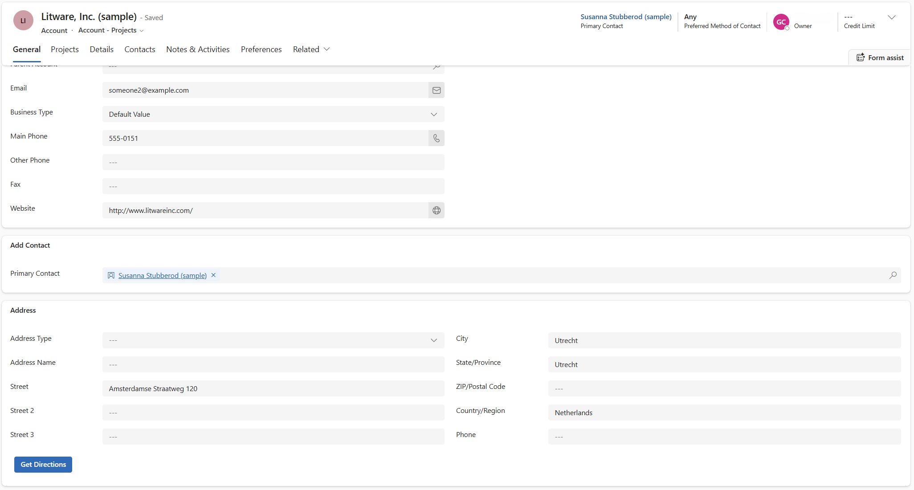

# Get Directions — PCF control for Power Apps (Dynamics 365)

A lightweight [PowerApps Component Framework](https://learn.microsoft.com/power-apps/developer/component-framework/overview) (PCF) **virtual control** that adds a button to a model-driven form. One click opens turn-by-turn directions to the record's address in the user's chosen maps provider **Google Maps, Bing Maps, Apple Maps, or OpenStreetMap** routed from their current location.

No API key. No maps license. No tenant configuration. Works on **any table, including custom tables**.

<p align="center">
  
</p>


---

## Why

Model-driven apps have a native embedded map with directions, but it only works on a fixed set of standard tables, needs the tenant-level Bing Maps setting (off by default in the EU), allows just one map component per form, and rides on a maps platform Microsoft is migrating from Bing to Azure Maps. **Get Directions** is the simple alternative: a single button, on any table, that just hands an `https://` link to whatever maps app the user already has.

## Features

- One-tap directions from a record's address; launches the **native maps app on mobile**.
- Four providers: **Google** (default), **Bing**, **Apple**, **OpenStreetMap**.
- Optional custom button label.
- Disabled automatically when the record has no address.
- Fully localisable (ships with English).
- **No Dataverse calls, no outputs, no premium flag** — `external-service-usage` is disabled.

## Compatibility

| | |
|---|---|
| App types | Model-driven Power Apps / Dynamics 365 CE |
| Control | `gc.GetDirections` (virtual / React) |
| Control version | 0.0.3 · Solution `GcGetDirections` 1.2.0.0 |
| Platform libraries | React 16.14.0, Fluent UI 9.46.2 (host-provided) |
| Publisher | Gc Solutions (prefix `gc`) |

## Install

1. Download the managed solution **`GcGetDirections_managed_1_2.zip`** from the [latest release](https://github.com/powercode1992/get-directions-button-pcf/releases/tag/v1.2.0).
2. In `make.powerapps.com`: **Solutions → Import solution → ** select the zip → **Import**.

> **Heads-up — the host-field pattern:** because a PCF field control replaces the field it's bound to, you place this control on a **dedicated spare single-line text column** (the "host"), and bind the address columns to it as read-only inputs. Your real address fields stay editable. One spare column is needed per table. Full steps are in the User Guide.

## Properties

| Property | Type | Required | Description |
|---|---|---|---|
| Button host field (`gc_Host`) | Text (bound) | No | The spare cell the button replaces; value not used. |
| Street (`gc_Street`) | Text (bound) | **Yes** | e.g. `address1_line1` |
| City (`gc_City`) | Text (bound) | No | e.g. `address1_city` |
| Postal code (`gc_PostalCode`) | Text (bound) | No | e.g. `address1_postalcode` |
| Country (`gc_Country`) | Text (bound) | No | e.g. `address1_country` |
| Maps provider (`gc_Provider`) | Enum (input) | No | `google` (default) / `bing` / `apple` / `osm` |
| Button label (`gc_ButtonLabel`) | Text (input) | No | Optional override of the default "Get directions" |

## How it works

The control composes the bound address parts into one line and builds a provider deep link with the origin omitted (so the provider uses the device's current location), then opens it via the PCF navigation service:

| Provider | URL pattern |
|---|---|
| Google Maps | `https://www.google.com/maps/dir/?api=1&destination=…` |
| Bing Maps | `https://www.bing.com/maps?rtp=~adr.…` |
| Apple Maps | `https://maps.apple.com/?daddr=…` |
| OpenStreetMap | `https://www.openstreetmap.org/search?query=…` (location view) |

It makes no Dataverse Web API calls and produces no outputs — purely a read-and-open action.

## Build from source

```bash
npm install
npm run build          # output → out/controls
npm run start:watch    # local test harness
```

Package the managed solution from the solution project with `dotnet build -c Release`.


## Notes & limitations

- Requires one spare host column per table (the host-field trade-off).
- OpenStreetMap opens a map search, not turn-by-turn routing.
- Bing consumer maps are being retired by Microsoft in favour of Azure Maps; Google/Apple are the most future-proof.
- Clicking shares the address with the selected third-party provider (inherent to opening directions). See [`NOTICE.md`](NOTICE.md).

## Support

Community-supported, no SLA. Please raise issues at `https://github.com/powercode1992/get-directions-button-pcf/issues?reload=1`. Maintained by `Gc Solutions`.

## License

See [`LICENSE`](LICENSE). Copyright © 2026 Gc Solutions. See [`NOTICE.md`](NOTICE.md) for the warranty disclaimer and third-party maps attribution.

> ⚠️ Directions and map data are provided by the selected third-party provider. **Verify all routes before travel. Use at your own risk.**
